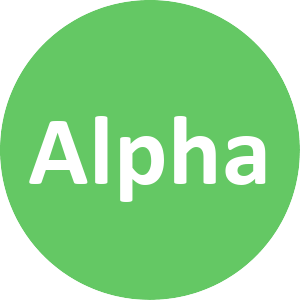
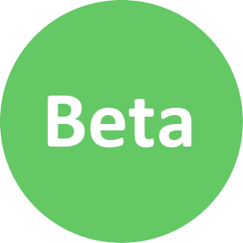
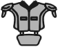
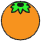
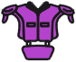
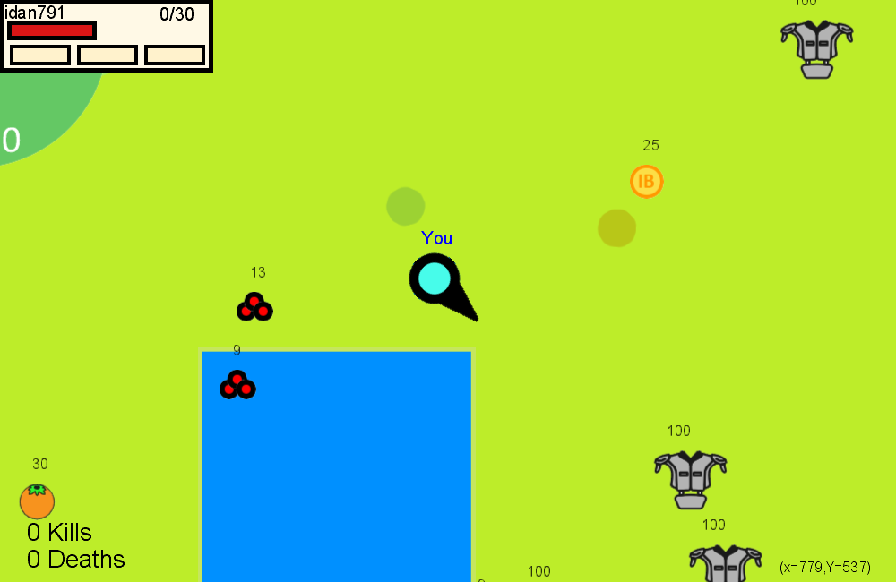
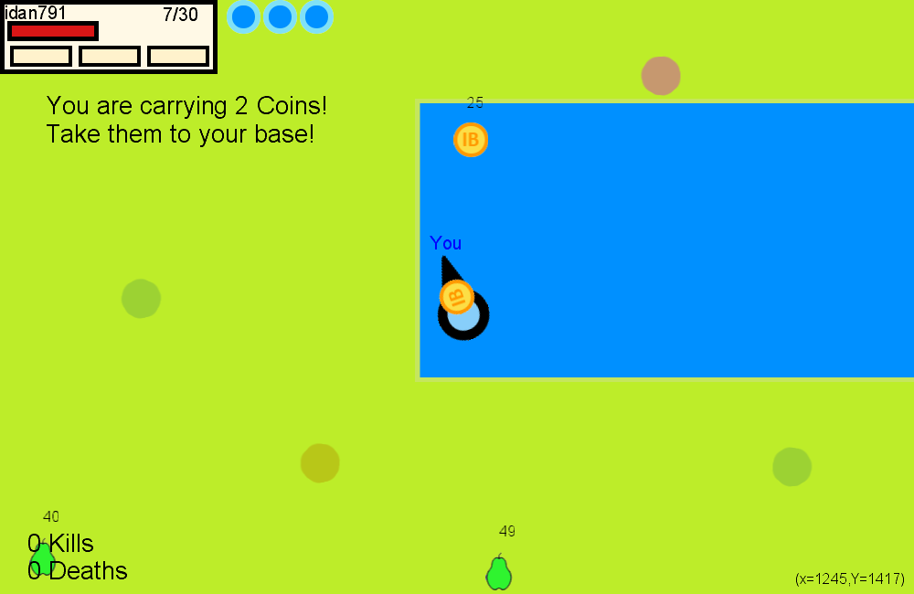

# Squad Fighters

**Squad Fighters** is a multiplayer game in an open world divided into three groups of players fighting each other for a quantity of special coins hidden in the big map, the first group to find and bring all the coins to their base wins.

   

## How to play?

### Teams

The game is divided into three groups - **Alpha**, **Beta** and **Omega**.
The goal of each team is to find all the hidden coins around the map and bring them to your team base before the opposing teams.

<table border="1" cellspacing="0">
 <tr>
  <th>Alpha</th>
  <th>Beta</th>
   <th>Omega</th>
 </tr>
 <tr>
  <td>
   
  </td>
  <td>
   
  </td>
  <td>
   
  </td>
 </tr>
</table>

### Characters

Each team has unique color:

<table border="1" cellspacing="0">
 <tr>
  <th>Alpha</th>
  <th>Beta</th>
   <th>Omega</th>
 </tr>
 <tr>
  <td>
   
  </td>
  <td>
   
  </td>
  <td>
   
  </td>
 </tr>
</table>

### World random items

Every time you enter the server, the world is created randomly, and contains items in different places such as: shields of different levels, foods and fruits and weapons.

<table border="1" cellspacing="0">
 <tr>
  <th>Food</th>
  <th>Armors</th>
   <th>Weapons</th>
 </tr>
 <tr>
  <td>
   
  </td>
  <td>
   
  </td>
  <td>
   
  </td>
 </tr>
  <tr>
  <td>
   
  </td>
  <td>
   
  </td>
  <td>
	No Item
  </td>
 </tr>
 <tr>
  <td>
   
  </td>
  <td>
   
  </td>
  <td>
	No Item
  </td>
 </tr>
  <tr>
  <td>
No Item
  </td>
  <td>
   
  </td>
  <td>
	No Item
  </td>
 </tr>
</table>

### Gallery

<table border="1" cellspacing="0">
 <tr>
  <td>
   
  </td>
  <td>
   
  </td>
   <td>
   
  </td>
 </tr>
 <tr>
  <td>
   
  </td>
  <td>
   
  </td>
 </tr>
</table>
